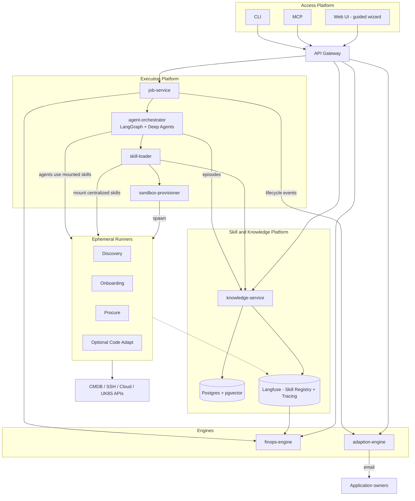
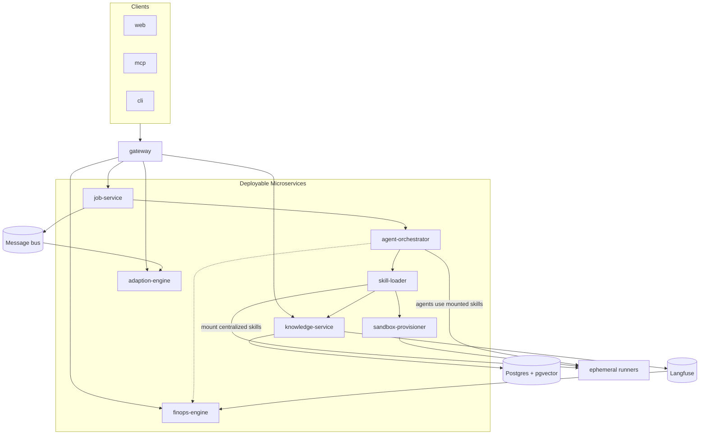
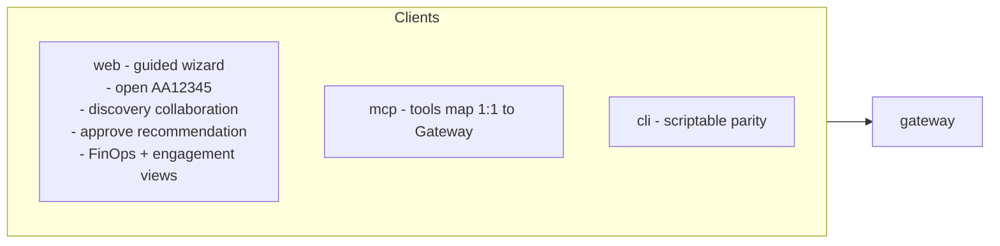
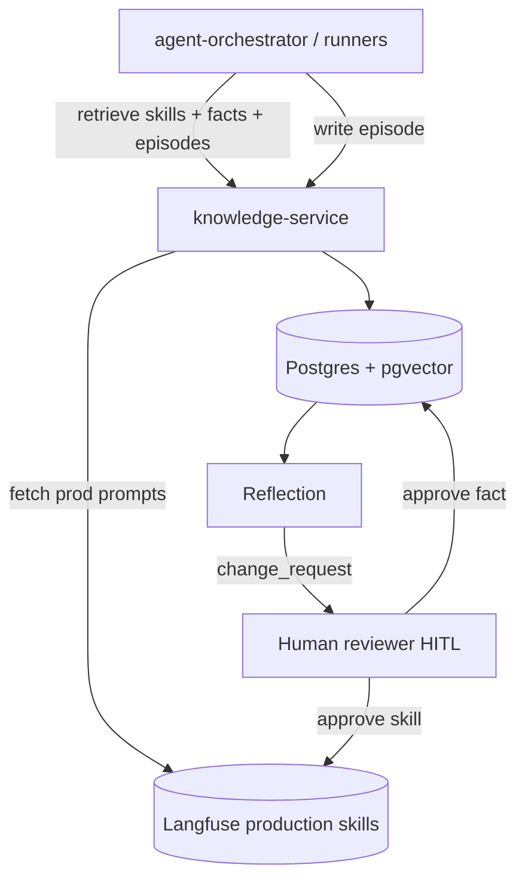
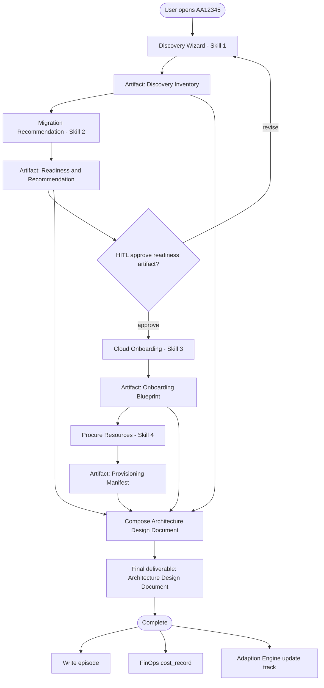
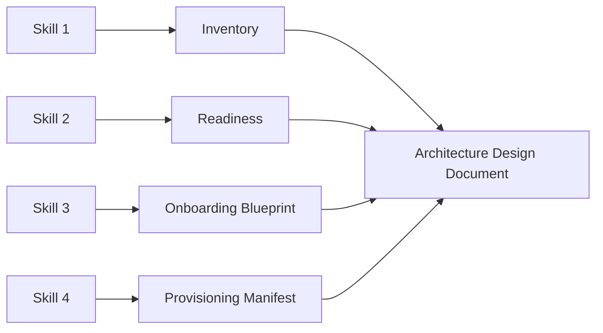
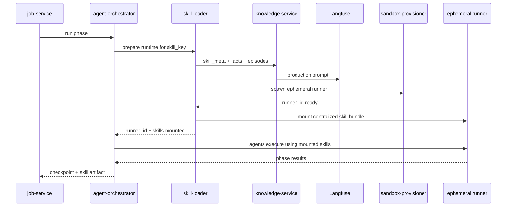
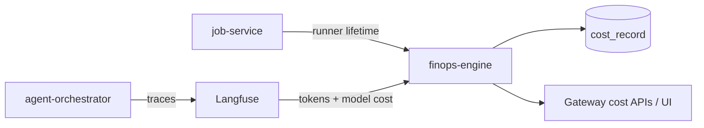
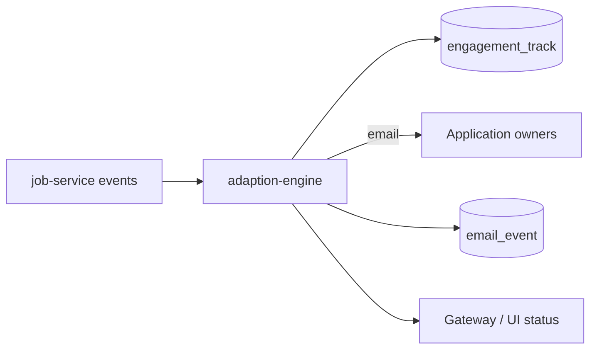

# ICE — Infrastructure Discovery & Migration Platform

## Architecture (Microservices)

> **Scope of this document:** Architecture only. No application code yet.  
> Reference patterns (Deep Agents, LangGraph, skill registry, ephemeral runners) were adapted from a prior migration-platform design — ICE is a different product.

---

## Goal

**ICE** is an interactive enterprise platform for **Infrastructure Discovery and Migration**.

Users bring an **application number** (e.g. `AA12345`) and work through a guided flow to:

1. Discover infrastructure around the application → **Discovery Inventory Artifact**
2. Get a **migration recommendation** (readiness scores) → **Readiness & Recommendation Artifact**
3. Perform **cloud / UK8S onboarding** → **Onboarding Blueprint Artifact**
4. **Procure and create** approved resources → **Provisioning Manifest Artifact**
5. Compose the final **Architecture Design Document** from those artifacts

**There is no Merge Request (MR) in this process.** Deliverables are skill artifacts and the Architecture Design Document.

### Platforms (physical)

| Platform | Role |
|----------|------|
| **Access Platform** | Interactive UI (guided wizard), MCP, CLI + API Gateway |
| **Skill & Knowledge Platform** | Skills, org memory, skill registry (Langfuse), governance |
| **Execution Platform** | LangGraph + Deep Agents control plane + ephemeral runners |

### Logical fabrics / frameworks

| Fabric / Framework | Concern |
|--------------------|---------|
| **Connectivity Fabric** | Clients + Gateway + SSE |
| **Context Fabric** | Skills, prompts, semantic + episodic memory |
| **Orchestrator Framework** | Jobs, LangGraph, Deep Agents, Skill Loader |
| **Execution Framework** | Ephemeral runners, provisioner, phase work |
| **Evaluation Framework** | Tracing + **FinOps Engine** (agent cost per run) |

**Cross-cut:** **Adaption Engine** — engagement tracks + emails to application owners.

---

## System Overview

### Architecture diagrams (draw.io)

| # | Diagram | Notes |
|---|---------|-------|
| 01 | [`docs/01-overall-process.drawio`](docs/01-overall-process.drawio) / [`ICE.drawio`](ICE.drawio) | Full layered architecture (DSE-style) — ICE skills → artifacts → ADD, no MR ([notes](docs/01-overall-process.md)) |
| 02 | [`docs/02-microservices-map.drawio`](docs/02-microservices-map.drawio) | All microservices + gateway ([notes](docs/02-microservices-map.md)) |
| 03 | [`docs/03-system-overview.drawio`](docs/03-system-overview.drawio) | Platforms, engines, runners ([notes](docs/03-system-overview.md)) |
| 04 | [`docs/04-skill-knowledge-platform.drawio`](docs/04-skill-knowledge-platform.drawio) | Skills, memory, update loop ([notes](docs/04-skill-knowledge-platform.md)) |
| 05 | [`docs/05-execution-runners.drawio`](docs/05-execution-runners.drawio) | skill-loader → provisioner → mount → agents ([notes](docs/05-execution-runners.md)) |
| 06 | [`docs/06-discovery-wizard.drawio`](docs/06-discovery-wizard.drawio) | Interactive Discovery wizard ([notes](docs/06-discovery-wizard.md)) |
| 07 | [`docs/07-skill-artifacts.drawio`](docs/07-skill-artifacts.drawio) | Artifacts → Architecture Design Document ([notes](docs/07-skill-artifacts.md)) |
| 08 | [`docs/08-finops-engine.drawio`](docs/08-finops-engine.drawio) | Agent cost per run ([notes](docs/08-finops-engine.md)) |
| 09 | [`docs/09-adaption-engine.drawio`](docs/09-adaption-engine.drawio) | Tracks + email owners ([notes](docs/09-adaption-engine.md)) |
| 10 | [`docs/10-logical-fabrics.drawio`](docs/10-logical-fabrics.drawio) | Five fabrics/frameworks ([notes](docs/10-logical-fabrics.md)) |

Index: [`docs/README.md`](docs/README.md)


---

## Microservice Map

ICE is a **microservice architecture**. Each service below is an independently deployable unit with a clear API and ownership boundary. Clients never call execution services directly — only via **gateway**.



**skill-loader** is the mount hub: it resolves skills from the central registry (via knowledge-service / Langfuse), asks **sandbox-provisioner** to spawn runners, and **mounts** those skills onto **ephemeral runners** so agents can use them. Orchestrator does not inject skills into runners directly.
### Service catalogue

| Microservice | Platform | Responsibilities | Primary data |
|--------------|----------|------------------|--------------|
| **gateway** | Access | Auth (e.g. Entra ID), RBAC, REST + SSE routing, rate limits | Session / auth only |
| **web** | Access | Interactive guided wizard UI | None (API client) |
| **mcp** | Access | MCP tools → Gateway parity | None |
| **cli** | Access | Scriptable / CI client | None |
| **knowledge-service** | Skill & Knowledge | Application inventory, skills metadata, semantic + episodic memory, change-request review | Postgres + Langfuse pointers |
| **job-service** | Execution | Application job lifecycle, hybrid phase skip/re-run, HITL state, event publish | Job + plan state |
| **agent-orchestrator** | Execution | LangGraph state machine, Deep Agents; agents **consume** skills already mounted on runners | LangGraph checkpoints |
| **skill-loader** | Execution | **Central mount authority** — resolve production skills/facts/episodes; talk to sandbox-provisioner; mount skill bundles onto ephemeral runners for agents | Transient bundles + mount records |
| **sandbox-provisioner** | Execution | Create/destroy ephemeral runners; apply mount instructions from skill-loader | Runner refs / TTL |
| **finops-engine** | Evaluation | Agent + runner cost per run; rollups by app/skill/day | `cost_record` |
| **adaption-engine** | Engagement | Engagement tracks; email application owners on lifecycle events | `engagement_track`, `email_event` |

### Shared infrastructure

- **Postgres + pgvector** — structured domain data + embeddings
- **Langfuse** — procedural skill prompts (`draft` / `staging` / `production`) + tracing
- **Message bus** — durable job/event fan-out (e.g. Azure Service Bus)
- **Runner workspace store** — per-job share for discovery artifacts (e.g. Azure Files / PVC)

### Design seams

- **SandboxBackendProtocol** — local Docker first; swap to AKS/K8s runners without changing agent code
- **Skill mount contract** — centralized skills are never baked into images. **skill-loader** resolves them and mounts them onto ephemeral runners (via sandbox-provisioner). Agents only use skills that skill-loader has mounted for that run.
- **Gateway as single edge** — UI / MCP / CLI stay thin and at parity

---

## Logical Architecture — Fabrics Mapping

| Fabric / Framework | Microservices |
|--------------------|---------------|
| Connectivity | gateway, web, mcp, cli, adaption-engine (outbound email) |
| Context | knowledge-service, Langfuse prompts, Postgres memory |
| Orchestrator | job-service, agent-orchestrator |
| Execution | sandbox-provisioner, ephemeral runners, **skill-loader** (mount into runners) |
| Evaluation | Langfuse traces, finops-engine, optional validation hooks |

---

## Core Domain Model

Everything is anchored on **Application ID** (`AA12345`), not a git repo.

| Entity | Description |
|--------|-------------|
| **Application** | id, name, owner contacts, criticality, target (UK8S / RHEL10 / …) |
| **Infrastructure CI** | Servers, middleware, DBs, networks, dependencies |
| **Discovery Session** | Wizard state: user inputs + agent findings + confidence |
| **Skill Artifact** | Versioned output of each skill run (inventory, readiness, blueprint, provision manifest) |
| **Readiness Assessment** | Dimension scores → overall readiness + recommendation path |
| **Migration Plan** | Target architecture, onboarding steps, resource requirements |
| **Architecture Design Document** | **Final deliverable** — composed from skill artifacts (no MR) |
| **Episode** | Past run outcomes for learning / few-shot retrieval |
| **Cost Record** | Per job/phase/agent: tokens, model $, runner $, totals |
| **Engagement Track** | Per app: stage, owners, SLA clocks, next nudge |
| **Email Event** | Audit of Adaption Engine sends |

### Logical data ownership

| Service | Tables / stores (logical) |
|---------|---------------------------|
| knowledge-service | `application`, `infrastructure_ci`, `discovery_session`, `skill_meta`, `org_asset`, `episode`, `change_request` |
| job-service | `job`, `skill_artifact`, `readiness_assessment`, `migration_plan`, `architecture_design_document` |
| finops-engine | `cost_record` |
| adaption-engine | `engagement_track`, `email_event` |
| agent-orchestrator | LangGraph checkpoints (separate store) |

---

# PART A — Access Platform

Thin clients over **gateway**. No business logic in clients.



### Starter Gateway routes (application-centric)

- `POST /applications/{id}/discover` — start / continue Discovery wizard
- `GET /applications/{id}/inventory` — validated CI inventory
- `POST /applications/{id}/recommend` — run Migration Recommendation
- `POST /applications/{id}/approve` — HITL gate on readiness plan
- `POST /applications/{id}/onboard` — Cloud Onboarding
- `POST /applications/{id}/procure` — Procure resources → Provisioning Manifest Artifact
- `GET /applications/{id}/jobs/{job_id}/artifacts` — list skill artifacts
- `GET /applications/{id}/jobs/{job_id}/artifacts/{artifact_id}` — fetch artifact
- `GET /applications/{id}/jobs/{job_id}/architecture-design-document` — final ADD
- `GET /applications/{id}/jobs/{job_id}` — status
- `GET /applications/{id}/jobs/{job_id}/events` — SSE progress
- `GET /applications/{id}/costs` — FinOps rollup for app
- `GET /applications/{id}/engagement` — Adaption track status

RBAC roles (illustrative): `viewer`, `migrator`, `skill-author`, `skill-reviewer`, `admin`, `finops-viewer`.

---

# PART B — Skill & Knowledge Platform

Procedural skill content lives in **Langfuse Prompt Management**. Metadata, org facts, episodes, and governance live in **Postgres + pgvector** behind **knowledge-service**.



## B1. Four ICE skills (procedural)

| Skill | Purpose | Artifact produced | Mounted into |
|-------|---------|-------------------|--------------|
| **1. Application Discovery** | Guided discovery of infra around `AA12345` | Discovery Inventory Artifact | Discovery runner |
| **2. Migration Recommendation** | Readiness scores + recommended path | Readiness & Recommendation Artifact | Orchestrator / scoring path |
| **3. Cloud Onboarding** | Prepare for UK8S / target platform | Onboarding Blueprint Artifact | Onboarding runner |
| **4. Procure & Create Resources** | Create approved resources | Provisioning Manifest Artifact | Procure runner |

**Final composition (not a skill mount):** Architecture Design Document — assembled from the four skill artifacts after the pipeline (or after the last executed skill in a hybrid path).

Optional secondary: **Code Adapt** — only when recommendation requires app code changes; emits an Adapt Report Artifact. Still **no MR**.

## B2. Three memory types

| Memory | What | Store |
|--------|------|-------|
| **Procedural** | How to discover / recommend / onboard / procure | Langfuse (`production` label) |
| **Semantic** | Org facts: UK8S standards, images, network zones, RHEL baselines, catalogs | Postgres + embeddings |
| **Episodic** | Past migrations: scores, outcomes, failures | Postgres + embeddings |

## B3. Skill update loop

Completed jobs write **episodes** → reflection opens **change_request** → skill-reviewer HITL → publish to Langfuse or update semantic facts. Rollback = re-point Langfuse `production` label.

---

# PART C — Execution Platform

## C1. Job lifecycle (hybrid)

Default pipeline: **Discovery → Recommendation → HITL → Onboarding → Procure**. Skills may be **re-run** or **skipped** when prior outputs remain valid.



Primary human gate: **after Migration Recommendation**, before irreversible onboarding/procure.

**Outputs (no MR):** each completed skill persists a **skill artifact**. After Procure (or when the approved path completes), the platform **composes the Architecture Design Document** from all skill artifacts. There is **no Merge Request / PR** in this process.

## C2. Discovery wizard (interactive)

Discovery is a **guided collaboration**, not a silent batch CMDB pull:

1. User opens application on the platform
2. Agent and user walk servers, dependencies, and configs step by step
3. Agent may enrich with live checks / APIs when available
4. User confirms inventory → persisted as **Discovery Inventory Artifact** → input to Recommendation

Wizard progress is checkpointed in LangGraph; UI receives SSE updates.

## C2b. Skill artifacts & Architecture Design Document

| Skill / step | Artifact |
|--------------|----------|
| Application Discovery | Discovery Inventory Artifact |
| Migration Recommendation | Readiness & Recommendation Artifact |
| Cloud Onboarding | Onboarding Blueprint Artifact |
| Procure & Create Resources | Provisioning Manifest Artifact |
| **Final composition** | **Architecture Design Document** |



Artifact metadata lives with job-service / knowledge-service; payload in workspace/object store. ADD is a first-class downloadable/viewable deliverable in the UI — **not** a git merge.

## C3. Ephemeral runners + skill mounting

**Control plane (always-on):** gateway edge → job-service, agent-orchestrator, **skill-loader**, sandbox-provisioner, credentials. Never runs untrusted infra commands itself.

**Data plane (ephemeral):** runners per phase; **centralized skills mounted by skill-loader** at start; torn down after TTL/completion.

**skill-loader** talks to:
- **knowledge-service / Langfuse** — resolve production skill content + facts + episodes  
- **sandbox-provisioner** — spawn / prepare the ephemeral runner for this phase  
- **ephemeral runners** — mount the skill bundle so agents on that runner can use it  



Agents produced for a phase **use** the skills skill-loader mounted; they do not pull registry content themselves.
Runner types (same or phase-specific images):

| Runner | Used by |
|--------|---------|
| Discovery | Skill 1 — probes, parsers, inventory writes |
| Onboarding | Skill 3 — UK8S / platform APIs |
| Procure | Skill 4 — Terraform / internal provision APIs |
| Code Adapt | Optional — isolated code workspace |

## C4. Orchestration notes

- LangGraph provides durable state, retries, HITL pause/resume
- Deep Agents orchestrator may fan out sub-agents inside a phase and consolidate
- One runner workspace per job; no cross-job leakage
- Idle TTL + sweeper for orphaned runners

---

# PART D — FinOps Engine

**Purpose:** answer “what did this agent run cost?” per job, application, skill, and day.



### Responsibilities

- Ingest Langfuse spans (tokens, model, latency) keyed by `job_id` / phase / skill / agent
- Attribute ephemeral runner compute when metered (pod lifetime × rate)
- Persist `cost_record`; expose rollups
- Optional soft budgets / alerts

### Example `cost_record` fields

`id`, `job_id`, `application_id`, `skill_key`, `phase`, `agent_id`, `token_input`, `token_output`, `model_cost`, `runner_cost`, `total_cost`, `currency`, `recorded_at`

---

# PART E — Adaption Engine

**Purpose:** keep **tracks** of each application’s migration journey and **email application owners** so work continues (HITL, stalls, EoL urgency, stage transitions).

> Naming: **Adaption Engine** = owner engagement. **Code Adapt skill** = optional code changes. They are different.



### Example triggers

| Event | Email intent |
|-------|----------------|
| Recommendation ready | Ask owner to review / approve plan |
| HITL idle > N days | Reminder |
| Discovery wizard abandoned | Nudge to resume |
| Procure complete | Summary + next validation steps |
| EoL approaching | Urgency / program outreach |

### Engagement track fields (logical)

`application_id`, `stage`, `owner_emails`, `last_contact_at`, `next_action`, `sla_due_at`, `status`

---

# Design Principles

Adapted from the reference design; ICE examples replace code-migration examples.

| Principle | ICE application |
|-----------|-----------------|
| **Modular** | Microservices + clear APIs; swap Docker ↔ K8s runners behind one protocol |
| **Scalable** | Gateway replicas; workers on queue depth; runners on demand |
| **Portable** | Agent logic cloud-agnostic; infra bindings pluggable |
| **Open** | REST + MCP + CLI; skills as `SKILL.md` / prompts, not binaries |
| **HITL** | Recommendation approval; skill-review for knowledge updates |
| **Agent / sub-agent** | Orchestrator in control plane; work in runners; credentials stay central |
| **Parallelism** | Fan-out within phases; many jobs across workers |
| **Handoffs** | FIFO pipeline + circular revise loops + fan-out/consolidate + handoff-to-human |
| **State layers** | Job DB, LangGraph checkpoints, runner workspace, knowledge, traces, cost, engagement |

---

# Cross-cutting

## Observability

- Langfuse: LLM/agent traces (`job_id` root span)
- FinOps: cost truth per run
- Infra metrics: runner OOM, queue depth, TTLs (e.g. App Insights)

## Proposed monorepo layout (for later implementation — not created yet)

```
ice/
├── apps/
│   ├── web/
│   ├── cli/
│   └── mcp/
├── services/
│   ├── gateway/
│   ├── knowledge/
│   ├── job/
│   ├── orchestrator/      # agent-orchestrator + skill-loader
│   ├── sandbox/           # sandbox-provisioner
│   ├── finops/
│   └── adaption/
├── runners/               # runner images / exec bridge
├── infra/
├── docs/                  # architecture diagrams (.mmd)
└── skills/                # seed SKILL.md content
```

## Key decisions

- ICE is **infra discovery & migration**, application-centric (`AA12345`)
- Four primary skills; each emits a **skill artifact**; pipeline ends with **Architecture Design Document**
- **No Merge Request / PR** in the ICE process
- Interactive discovery wizard first-class
- HITL after Recommendation artifact
- Microservices behind gateway; **skill-loader** mounts centralized skills onto ephemeral runners (via sandbox-provisioner) for agents
- FinOps Engine for agent cost per run
- Adaption Engine for tracks + owner email

## Architecture status & next steps

| Done in this phase | Explicitly not done |
|--------------------|---------------------|
| This architecture doc | Application / service source code |
| Microservice boundaries | Deployable stubs / scaffolds |
| Mermaid diagrams in `docs/*.mmd` | Production infra/Terraform |

**Next:** review this architecture → then scaffold microservices.

## Open items (TBD)

- UK8S / provisioning API surface
- Live discovery mechanisms per CI type
- Readiness score dimensions and weights
- Cloud provider bindings
- Adaption email transport (Graph / SMTP / SES)
- FinOps v1: model $ only vs include runner compute $
