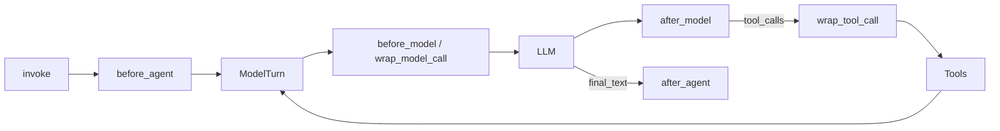

# Program: under-the-hood

Map of everything `create_deep_agent` builds. Source of truth: `libs/deepagents/deepagents/graph.py` in [langchain-ai/deepagents](https://github.com/langchain-ai/deepagents). Prefer source over docs when they disagree (notably: todos are opt-in since v0.7).

## Inputs

- Need to explain, debug, or rebuild a Deep Agent layer

## Checklist

```
Task Progress:
- [ ] Step 1: Name the runtime
- [ ] Step 2: Trace factory assembly
- [ ] Step 3: Map middleware → capability
- [ ] Step 4: Map hooks in the ReAct loop
- [ ] Step 5: Point to Path A or Path B next action
```

### Step 1: Name the runtime

```text
create_deep_agent(...)
  → assembles middleware + tools + prompt
  → calls create_agent(...)
  → returns CompiledStateGraph (LangGraph)
```

The agent loop is: model → (optional tool calls) → tools → model … until a final text answer. That loop **is** `create_agent`. Never hand-roll it.

### Step 2: Trace factory assembly

What `create_deep_agent` does, in order:

1. **Resolve model** + active `HarnessProfile` (provider extras, excluded tools, optional Codex todos)
2. **Backend** — caller `backend=` or default `StateBackend()`
3. **Process `subagents=`** — declarative / compiled / async; fill defaults; auto-add **general-purpose** unless disabled or already provided
4. **Assemble main middleware** (see [../references/harness-middleware-stack.md](../references/harness-middleware-stack.md))
5. **Merge caller `middleware=`** — same `.name` replaces in place; else splice after core
6. **Tail** — prompt caching, `MemoryMiddleware` (if `memory=`), `HumanInTheLoopMiddleware` (if interrupts), tool-exclusion filter
7. **`create_agent(model, system_prompt=..., tools=..., middleware=..., ...)`** → graph

Authored system prompt: `USER` (`system_prompt=`) → profile `BASE` → `SUFFIX`. Skills/memory/todo fragments are appended later by middleware via `wrap_model_call`, not by the factory string alone.

### Step 3: Map middleware → capability

| Capability | Middleware / mechanism | Default? |
|------------|------------------------|----------|
| Skills index in prompt | `SkillsMiddleware` | If `skills=` |
| FS tools + permissions | `FilesystemMiddleware` | Always (required) |
| `task` + GP subagent | `SubAgentMiddleware` | If any sync subagent (required class) |
| History compression | `create_summarization_middleware` | Always |
| Dangling tool-call repair | `PatchToolCallsMiddleware` | Always |
| Background subagents | `AsyncSubAgentMiddleware` | If async specs |
| Structured todos | `TodoListMiddleware` | **Opt-in** (or Codex profile) |
| AGENTS.md memory | `MemoryMiddleware` | If `memory=` |
| HITL | `HumanInTheLoopMiddleware` | If `interrupt_on` / permission interrupts |

Cannot exclude: `FilesystemMiddleware`, `SubAgentMiddleware` (`_REQUIRED_MIDDLEWARE`).

### Step 4: Map hooks in the ReAct loop



Examples:

- `SkillsMiddleware.before_agent` — scan skill sources once per session
- `SkillsMiddleware.wrap_model_call` / `modify_request` — append skills index every turn
- `TodoListMiddleware.after_model` — reject parallel `write_todos`
- HITL — `HumanInTheLoopMiddleware.after_model` → LangGraph `interrupt(HITLRequest)` before tools
- FS `mode="interrupt"` — factory builds `when` predicates via `_build_interrupt_on_from_permissions`; FS middleware itself only allow/deny

### Step 5: Next action

| Goal | Go to |
|------|-------|
| Ship with factory | [create-deep-agent.md](create-deep-agent.md) |
| Rebuild stack | [assemble-deep-like-agent.md](assemble-deep-like-agent.md) |
| Skills details | [skills-progressive-disclosure.md](skills-progressive-disclosure.md) |
| Planning / `task` | [plan-and-decompose.md](plan-and-decompose.md) |
| Backends | [choose-backend.md](choose-backend.md) |
| HITL internals + resume | [human-in-the-loop.md](human-in-the-loop.md) |
| Guardrails | [apply-guardrails.md](apply-guardrails.md) |

## Failure modes

| Confusion | Truth |
|-----------|-------|
| "Deep Agents is a different runtime" | Same `create_agent` + LangGraph |
| "Todos always on" | Opt-in since v0.7 |
| "Legacy BASE_AGENT_PROMPT always applied" | Deprecated; caller must supply planning guidance |
| "excluded_middleware can drop Filesystem" | Raises / rejected for required classes |

## See also

- [../references/harness-middleware-stack.md](../references/harness-middleware-stack.md)
- [../references/api-cheatsheet.md](../references/api-cheatsheet.md)
