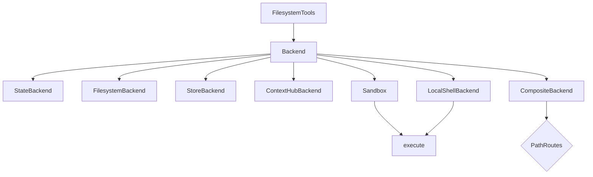

# Backends

Pluggable filesystem (and optional shell) backends for Deep Agents. Docs: [backends](https://docs.langchain.com/oss/python/deepagents/backends), [sandboxes](https://docs.langchain.com/oss/python/deepagents/sandboxes).

## Role

Built-in tools (`ls`, `read_file`, `write_file`, `edit_file`, `delete`, `glob`, `grep`) always go through a backend. Sandbox backends and `LocalShellBackend` also expose `execute`.

Skills, memory files, summarization offloads (`/large_tool_results/`, `/conversation_history/`), and agent scratch all live on the chosen backend.



## Catalog

| Backend | Persistence | `execute`? | Notes |
|---------|-------------|------------|-------|
| `StateBackend` | Thread via checkpointer | No | **Default.** Shared by main + subagents |
| `FilesystemBackend` | Real disk under `root_dir` | No | Use `virtual_mode=True`; wrap in Composite |
| `StoreBackend` | Cross-thread LangGraph Store | No | Always set `namespace=` for multi-tenant |
| `ContextHubBackend` | LangSmith Hub repo | No | Durable without separate Store |
| Sandbox providers | Isolated remote/local VFS | Yes | Prod code execution |
| `LocalShellBackend` | Host FS + host shell | Yes | Dev only — no isolation |
| `CompositeBackend` | Per-route | Per-route | Recommended production shape |

## Composite patterns

**Project files without polluting disk with internals:**

```python
CompositeBackend(
    default=StateBackend(),
    routes={
        "/workspace/": FilesystemBackend(root_dir="/abs/project", virtual_mode=True),
    },
)
```

**Scratch + long-term memory:**

```python
CompositeBackend(
    default=StateBackend(),
    routes={
        "/memories/": StoreBackend(
            namespace=lambda rt: (rt.server_info.user.identity,),
        ),
    },
)
```

**Full production mix:** State default + `/workspace/` disk or sandbox route + `/memories/` Store.

## Security hard rules

1. Bare `FilesystemBackend` writes agent internals under `root_dir` — **wrap in Composite**
2. `virtual_mode=True` required for path sandboxing on disk backends (default `False` is insecure)
3. `virtual_mode` does **not** secure LocalShell — shell can escape
4. Production shell → **sandbox**, not LocalShell
5. Store without namespace → shared assistant storage (legacy); always pass a factory for multi-user
6. `permissions=` apply to built-in FS tools only; use policy hooks for custom validation
7. Permissions on Composite with sandbox **default** must be scoped under known route prefixes or creation raises

## Namespace factories

```python
# Per user (recommended default)
namespace=lambda rt: (rt.server_info.user.identity,)

# Per assistant + user
namespace=lambda rt: (rt.server_info.assistant_id, rt.server_info.user.identity)

# Org-wide read-mostly policies
namespace=lambda rt: (rt.context.org_id,)
```

## StateBackend notes

- Files persist across turns in a thread via checkpoints; not shared across threads
- Subagent writes remain visible to the parent after the subagent finishes
- Prefer not to store huge blobs (checkpointed every step)

## Custom backends

Implement the backend protocol (`ls`, read/write/edit/delete, glob, grep). Sandboxes implement `execute` (`SandboxBackendProtocol`); when detected, the harness adds the `execute` tool.

## See also

- [../programs/choose-backend.md](../programs/choose-backend.md)
- [../examples/composite_backend.py](../examples/composite_backend.py)
