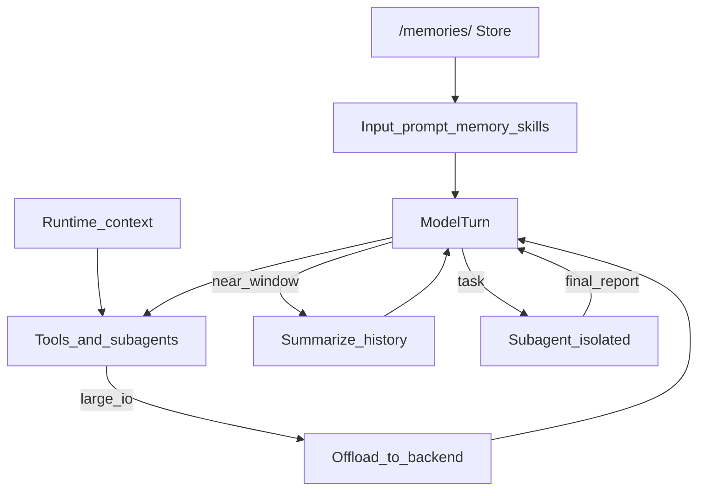

# Context engineering

How Deep Agents manage what the model sees across long-running work.

Docs: https://docs.langchain.com/oss/python/deepagents/context-engineering  
Concepts: https://docs.langchain.com/oss/python/concepts/context

## Context map

| Type | Control surface | Lifetime |
|------|-----------------|----------|
| **Input** | `system_prompt`, `memory=`, `skills=`, tool schemas / harness profile | Assembled each model turn |
| **Runtime** | `context_schema` + `context=` on invoke | Per run; propagates to subagents |
| **Compression** | Built-in offload + `SummarizationMiddleware` | Automatic near limits |
| **Isolation** | `task` / subagents | Child context discarded; report returns |
| **Long-term** | Backend files (often `/memories/` → Store) | Across threads |

## Input context

### System prompt

- Caller `system_prompt=` is the **USER** authored part (with profile BASE/SUFFIX)
- Static by default; use `@dynamic_prompt` middleware when text must depend on `runtime.context` / `runtime.store`
- Tools that only *read* context do **not** need middleware — they receive `ToolRuntime`
- Harness profiles can replace/append base prompt text

### Memory vs skills

| | Memory | Skills |
|--|--------|--------|
| Load | Always full file(s) | Index first; body on demand |
| Size guidance | Keep minimal | Put detailed workflows here |

### Tool prompts / schema cost

Built-in tool schemas are sent every turn even if unused. Shrink baseline with harness profile `excluded_tools` (configuration, not the same as offloading).

## Runtime context vs state_schema

| | `context_schema` / `context=` | `state_schema=` |
|--|------------------------------|-----------------|
| Mutability | Treat as immutable per-run inputs | Mutable graph state |
| Checkpoint | Not the conversation SoR | Checkpointed with thread |
| Examples | `user_id`, API keys, flags | Research notes, counters |
| Subagents | Propagates | Inherited by declarative `SubAgent` only |

## Context compression

Included by default in `create_deep_agent` (and Path B when you add summarization + FS middleware).

### Offloading

When tool **inputs** or **results** exceed ~**20,000 tokens**:

1. Content written to the configured backend (e.g. under `/large_tool_results/`)
2. Message history keeps a path reference + short preview (e.g. first 10 lines)
3. Agent re-reads / greps as needed

### Summarization

`SummarizationMiddleware` (via `create_summarization_middleware`):

- Typical trigger: **85%** of model `max_input_tokens`
- Keeps ~**10%** recent tokens
- Fallback if no profile: ~170k trigger / 6 messages kept
- On `ContextOverflowError`, summarize + retry
- Optional **summarization tool** (`create_summarization_tool_middleware`) for agent-timed compaction — does not disable auto summarization

Streaming: summarization tokens may appear; filter with `metadata.get("lc_source") == "summarization"`.

## Context isolation

Subagents:

- Fresh context window
- Return one final report (not full tool transcript)
- Best for multi-step / large-output work
- Instruct concise returns; park bulk data on the filesystem

See [planning-and-decomposition.md](planning-and-decomposition.md).

## Long-term memory (pointer)

Cross-thread persistence needs Composite `/memories/` → Store (or durable disk), not State-only scratch. Full guide: [memory.md](memory.md).

## Best practices

1. Lean always-on memory; rich skills  
2. Delegate heavy tool churn to subagents  
3. Cap subagent response size in their prompts  
4. Prefer offload/files over stuffing the transcript  
5. Tell the agent what `/memories/` is for  
6. Pass credentials/metadata via `context=`

## See also

- [../programs/context-engineering.md](../programs/context-engineering.md)
- [backends.md](backends.md) — where offloads land
- [harness-middleware-stack.md](harness-middleware-stack.md)
- https://docs.langchain.com/oss/python/deepagents/context-engineering
