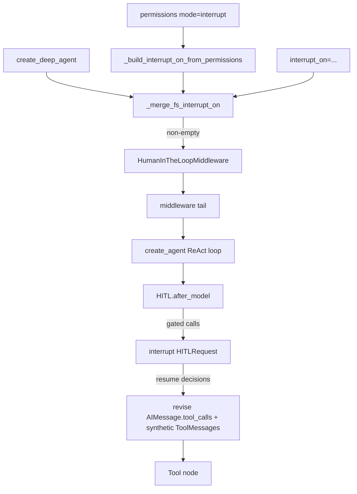

# Human-in-the-loop

Deep Agents HITL via LangGraph interrupts. Setting `interrupt_on` (or permission `mode="interrupt"`) adds `HumanInTheLoopMiddleware` to the [default stack](https://docs.langchain.com/oss/python/deepagents/customization#default-stack-main-agent).

Upstream: https://docs.langchain.com/oss/python/deepagents/human-in-the-loop  
Sources: `deepagents/graph.py`, `deepagents/middleware/_fs_interrupt.py`, `langchain.agents.middleware.HumanInTheLoopMiddleware`, `PatchToolCallsMiddleware`

## Flow

```text
Agent proposes tool call(s)
  → interrupt_on / permission interrupt? 
      no  → execute → back to agent
      yes → pause; human: approve | edit | reject | respond
            approve/edit → execute → agent
            reject/respond → ToolMessage → agent
```

## Internals (Path B)

### Who owns what

| Piece | Role |
|-------|------|
| `create_deep_agent` / `graph.py` | Merge FS permission interrupts + user `interrupt_on`; append `HumanInTheLoopMiddleware` near stack tail |
| `_build_interrupt_on_from_permissions` | Turn `mode="interrupt"` rules into per-FS-tool `InterruptOnConfig` with `when` predicates |
| `FilesystemMiddleware` | Enforce **allow/deny** only — does **not** call `interrupt()` itself |
| `HumanInTheLoopMiddleware` | LangChain middleware; `after_model` → `interrupt(HITLRequest)` |
| `PatchToolCallsMiddleware` | `before_agent`: synthetic ToolMessages for dangling tool_call ids |
| Checkpointer | Persist state between interrupt and `Command(resume=...)` |



### Factory merge (`graph.py`)

```text
fs_cfg  = _build_interrupt_on_from_permissions(permissions or [])
merged  = {**fs_cfg, **(user_interrupt_on or {})}   # user wins per tool name
if merged:
    middleware.append(HumanInTheLoopMiddleware(interrupt_on=merged))
```

- Empty merge → **omit** HITL middleware entirely
- Same merge applied for **main**, **general-purpose**, and each **declarative** subagent (see inheritance below)
- Bool `True` in user map expands to all four decisions; `False` is dropped when resolving configs (tool stays auto-approved)

### `HumanInTheLoopMiddleware.after_model`

Runs **after** the model returns an `AIMessage` with `tool_calls`, **before** tools execute:

1. For each tool call whose name is in `interrupt_on`, evaluate optional `when` (`True` / omitted → gate; `False` → skip, not batched)
2. Build one `HITLRequest`: `action_requests` + `review_configs`
3. Call LangGraph `interrupt(hitl_request)` — graph pauses; checkpointer stores thread
4. On resume, `interrupt()` returns `{"decisions": [...]}` (must match gated count/order)
5. For each gated call, `_process_decision`:
   - **approve** → keep original `ToolCall`
   - **edit** → replace name/args; **preserve** original `tool_call_id`
   - **reject** → keep call in message list but add `ToolMessage(status="error")` so the tool node does not run it as success; content = custom `message` or default “not executed; don’t retry…”
   - **respond** → `ToolMessage(status="success", content=message)` — human *is* the tool
6. Mutate `last_ai_msg.tool_calls` to the revised list; return `{"messages": [last_ai_msg, *artificial_tool_messages]}`

Ungated calls in the same turn stay in `tool_calls` unchanged and execute normally.

### FS permission → interrupt (`_fs_interrupt.py`)

Interrupt-mode rules synthesize configs for FS tools that share that operation:

| Tool | Op | Path arg | Scope |
|------|-----|----------|-------|
| `ls`, `glob`, `grep` | read | `path` | bulk (subtree / pathless) |
| `read_file` | read | `file_path` | exact |
| `write_file`, `edit_file` | write | `file_path` | exact |
| `delete` | write | `file_path` | bulk |

- **exact:** `when` → True iff `_check_fs_permission(...) == "interrupt"` (preceding **deny** wins → no HITL; tool returns denied)
- **bulk:** fire if search root overlaps an interrupt anchor; pathless `grep` / `.` → treat as whole tree; `glob` also gates absolute/`..` patterns so they cannot bypass via `path=`
- Generated configs use full `allowed_decisions` (approve/edit/reject/respond). Edited calls still re-hit FS deny checks at tool time.

### Stack position and hygiene

| Middleware | Hook | HITL relevance |
|------------|------|----------------|
| `PatchToolCallsMiddleware` | `before_agent` | If invoke cancelled mid-tools, injects “cancelled” ToolMessages so history stays valid |
| `HumanInTheLoopMiddleware` | `after_model` | Gate before tools; late in factory stack (after memory / caching tail) |

HITL does **not** replace permissions: deny still happens inside FS tools; interrupt only pauses matching calls.

### Subagent inheritance (factory)

| Spec kind | `interrupt_on` |
|-----------|----------------|
| Declarative `SubAgent` | Inherits top-level unless it sets its own (override, not merge with parent map — but still merges **its** permissions’ FS interrupts) |
| General-purpose | Same merge as main (`permissions` + top-level `interrupt_on`) |
| `CompiledSubAgent` | Does **not** inherit — wire HITL inside the compiled runnable |
| `AsyncSubAgent` / remote | Does **not** inherit — configure on the remote agent |

`task` tool HITL only covers the parent’s decision to launch a subagent — not every tool inside the child (child has its own middleware/`interrupt_on`). Interpreter dynamic `task()` bypasses parent tool HITL; gate `eval`.

### Path B wiring

```python
from langchain.agents.middleware import HumanInTheLoopMiddleware
from deepagents.middleware import PatchToolCallsMiddleware

middleware = [
    # ... FilesystemMiddleware, SubAgentMiddleware, summarization ...
    PatchToolCallsMiddleware(),
    HumanInTheLoopMiddleware(
        interrupt_on={
            "write_file": True,
            "execute": {"allowed_decisions": ["approve", "reject"]},
        }
    ),
]
# Prefer Path A if you also need permission mode="interrupt" merge —
# otherwise rebuild with _build_interrupt_on_from_permissions yourself.
```

## `interrupt_on` shapes

```python
interrupt_on = {
    "remove_file": True,   # full default decisions
    "fetch_file": False,   # never pause
    "notify_email": {"allowed_decisions": ["approve", "reject"]},
    "write_file": {
        "allowed_decisions": ["approve", "edit", "reject"],
        "when": writes_outside_workspace,  # optional; langchain>=1.3.3
    },
}
```

`when` receives `ToolCallRequest`; return `True` to interrupt. False calls never enter the interrupt batch.

## Decision payloads

```python
{"type": "approve"}

{"type": "reject", "message": "User rejected. Do not retry deletion."}

{"type": "edit", "edited_action": {"name": "notify_email", "args": {...}}}

{"type": "respond", "message": "Human answer as tool output"}  # ask_user style only
```

| Type | Tool runs? | Agent sees |
|------|------------|------------|
| approve | Yes, original args | Normal tool result |
| edit | Yes, edited args (same `tool_call_id`) | Normal tool result |
| reject | No | `ToolMessage(status="error")` — custom or default don’t-retry text |
| respond | No | `ToolMessage(status="success")` with human `message` |

## Invoke / resume (v2)

```python
from langgraph.types import Command

result = agent.invoke(input, config=config, version="v2")
if result.interrupts:
    value = result.interrupts[0].value
    actions = value["action_requests"]
    reviews = {c["action_name"]: c for c in value["review_configs"]}
    # decisions: one per action, same order
    result = agent.invoke(
        Command(resume={"decisions": decisions}),
        config=config,
        version="v2",
    )
# final: result.value["messages"]
```

Multiple gated tools in one model turn → **one** interrupt with all `action_requests`.

## Filesystem permission interrupts

`deepagents>=0.6.8`:

```python
FilesystemPermission(operations=["write"], paths=["/secrets/**"], mode="interrupt")
```

Factory converts these into `interrupt_on` entries with path-aware `when` predicates (`_fs_interrupt.py`). `FilesystemMiddleware` still only allow/denies at tool time. Preceding **deny** on the same path wins → no HITL. Handle resume like tool HITL. User `interrupt_on` for the same tool name overrides the generated config.

## Subagents

**Override on definition** (declarative; replaces inherited map, then re-merges that subagent’s permissions):

```python
subagents=[{
    "name": "file-manager",
    "description": "...",
    "system_prompt": "...",
    "tools": [delete_file, read_file],
    "interrupt_on": {"delete_file": True, "read_file": True},
}]
```

**`CompiledSubAgent` / remote:** no factory inheritance — put HITL inside the child graph / remote config.

**`interrupt()` inside a tool** (custom payload): resume with `Command(resume=<your value>)` — shape is whatever the tool expects (e.g. `{"approved": True}`), not necessarily `decisions`. Bubbles through the parent invoke the same way.

**Dynamic subagents:** parent `interrupt_on={"task": ...}` does **not** gate interpreter-spawned `task()`; interrupt on `eval` instead.

## Hygiene

- `PatchToolCallsMiddleware` (always in stack) repairs history if a run dies mid-tool
- Same `thread_id` on every resume
- Prefer explicit reject `message` for side-effecting tools
- Edit args sparingly

## Risk matrix (suggested)

```python
interrupt_on = {
    "delete": {"allowed_decisions": ["approve", "edit", "reject"]},
    "send_email": {"allowed_decisions": ["approve", "edit", "reject"]},
    "write_file": {"allowed_decisions": ["approve", "reject"]},
    "read_file": False,
    "ls": False,
}
```

## See also

- [../programs/human-in-the-loop.md](../programs/human-in-the-loop.md)
- [guardrails.md](guardrails.md)
- [dynamic-subagents.md](dynamic-subagents.md)
