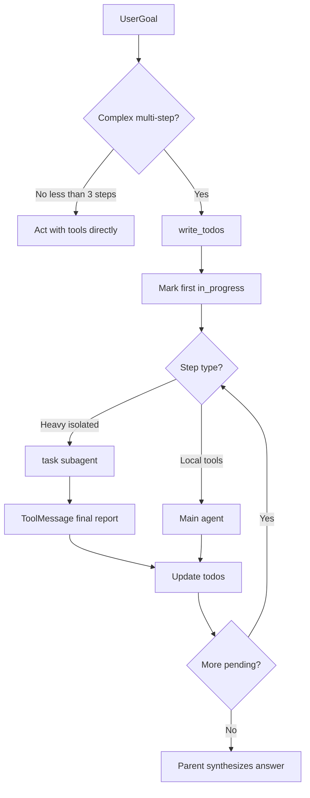

# Planning and task decomposition

Deep Agents do **not** ship a hard-coded planner. Breakdown is **LLM-driven**, enabled by two layers.

## Two layers

| Layer | Tool / middleware | Default? | Role |
|-------|-------------------|----------|------|
| Structured planning | `write_todos` via `TodoListMiddleware` | **Opt-in** (v0.7+) | Todo list in agent state |
| Execution isolation | `task` via `SubAgentMiddleware` | **On** (auto GP) | Ephemeral child agent |



## write_todos (planning)

Source: LangChain `TodoListMiddleware` (`WRITE_TODOS_SYSTEM_PROMPT`, `WRITE_TODOS_TOOL_DESCRIPTION`).

**When to use:** ≥3 distinct steps, careful planning, user-provided multi-task lists, plans that may revise.

**When not:** single straightforward task, trivial &lt;3 steps, pure conversation.

**Operational rules:**

- Replace entire list each call — never parallel `write_todos` (`after_model` rejects)
- Statuses: `pending | in_progress | completed`
- Mark first task(s) `in_progress` immediately; keep ≥1 in progress until done
- Complete immediately (no batching); revise as new info arrives
- Final answer in a **later** message after the last `write_todos` call

**State:** `todos` on agent state; **excluded** from subagent I/O (`_EXCLUDED_STATE_KEYS` with `messages`, `structured_response`).

**Wire:**

```python
from langchain.agents.middleware import TodoListMiddleware
create_deep_agent(..., middleware=[TodoListMiddleware()])
```

## task (execution decomposition)

Source: `SubAgentMiddleware` — `TASK_TOOL_DESCRIPTION`, `GENERAL_PURPOSE_SUBAGENT`.

**Schema:** `description` + `subagent_type`.

**Invocation flow:**

1. Filter parent state (drop messages, todos, structured_response, private attrs)
2. `messages = [HumanMessage(description)]`
3. Invoke subagent graph
4. Return `Command` + `ToolMessage` = last non-empty AI text (or structured JSON)

**Guidance to the model:**

- Full detail in `description` (stateless child)
- Parallel `task` calls in one turn when independent
- Report not shown to user — parent relays
- Bias to one comprehensive GP when only GP exists
- Avoid premature decomposition of monolithic research topics

**GP defaults:**

- Description: researching, file search, multi-step tasks; same tools as main
- System prompt: caller only sees final assistant message — make it complete

`create_deep_agent` does **not** pass an extra SubAgent system fragment listing agents; the available-agent list lives in the **tool description**.

## Canonical orchestrator flow

From Deep Agents research examples:

1. Plan (`write_todos`)
2. Context (read/save request)
3. Delegate (`task`) — default 1 subagent; parallelize only for comparisons / independent aspects
4. Act (remaining main-agent steps)
5. Verify (todos vs request)
6. Synthesize (user-facing answer)

Prompt template: [../examples/orchestrator_planning_prompt.md](../examples/orchestrator_planning_prompt.md).

## Anti-patterns

- Assuming todos without opting in
- Many narrow subagents for one topic
- Empty `description` relying on parent history (child cannot see it)
- Treating todo completion as the user answer

For **many independent units** orchestrated in code (JS loops / parallel batches), see [dynamic-subagents.md](dynamic-subagents.md) / [../programs/dynamic-subagents.md](../programs/dynamic-subagents.md).

## See also

- [../programs/plan-and-decompose.md](../programs/plan-and-decompose.md)
- [prompt-fragments.md](prompt-fragments.md)
- https://docs.langchain.com/oss/python/deepagents/overview#task-planning
- https://docs.langchain.com/oss/python/deepagents/subagents
- https://docs.langchain.com/oss/python/deepagents/dynamic-subagents
