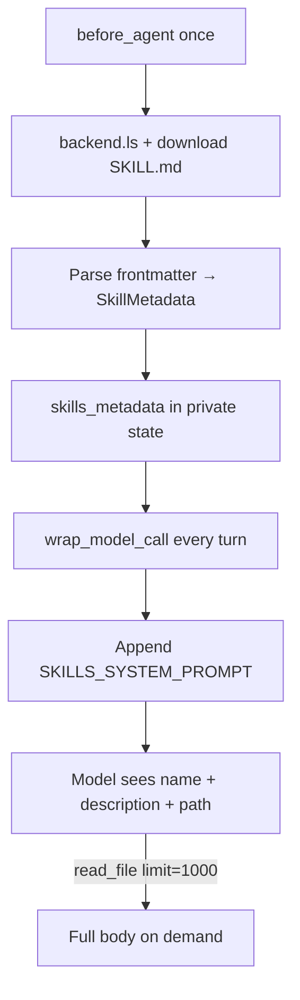

# Skills loading

How `SkillsMiddleware` discovers skills and injects them into the system prompt. Source: `libs/deepagents/deepagents/middleware/skills.py`.

## Progressive disclosure

| Phase | What loads | Mechanism |
|-------|------------|-----------|
| Session start | YAML frontmatter only | `before_agent` / `abefore_agent` |
| Every model call | Formatted skills index | `modify_request` → `append_to_system_message` |
| On demand | Full `SKILL.md` + assets | Agent calls `read_file` |



## Discovery rules

1. For each source path: list directories, download `.../SKILL.md`
2. Parse frontmatter: `name`, `description`, `path`, optional `license`, `compatibility`, `allowed_tools`, `metadata`
3. Later sources override earlier by `name` (last wins)
4. Skip re-scan if `skills_metadata` already in state (checkpoint reuse)
5. Load errors collected as warnings in the prompt fragment

Sources: bare path strings or `(path, label)` tuples. Labels render as `**{label} Skills**`.

## Index listing format

```text
- **{name}**: {description} (License: ..., Compatibility: ...)
  -> Allowed tools: a, b   # if allowed_tools set
  -> Read `{path}` for full instructions
```

## Wiring

```python
# Path A
create_deep_agent(backend=backend, skills=["/skills/user/", "/skills/project/"])

# Path B
SkillsMiddleware(backend=backend, sources=["/skills/user/", "/skills/project/"])
```

Factory also attaches the same sources to the auto-created general-purpose subagent. Declarative custom subagents must set `"skills": [...]` themselves.

Pass `system_prompt=None` to `SkillsMiddleware` to load metadata into state **without** appending the fragment (advanced).

## Dependencies

- Backend must expose skill files (`StateBackend` via `files=`, or disk/Composite routes)
- `read_file` must be available — middleware alone only injects the index
- Use `limit=1000` when reading `SKILL.md` (default 100 lines is too small)

## See also

- [../programs/skills-progressive-disclosure.md](../programs/skills-progressive-disclosure.md)
- [prompt-fragments.md](prompt-fragments.md) — `SKILLS_SYSTEM_PROMPT`
- https://docs.langchain.com/oss/python/deepagents/skills
