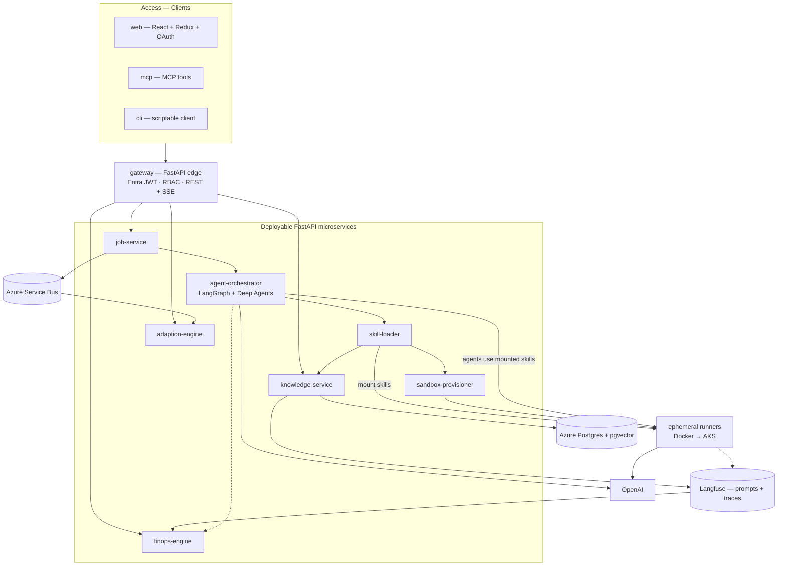
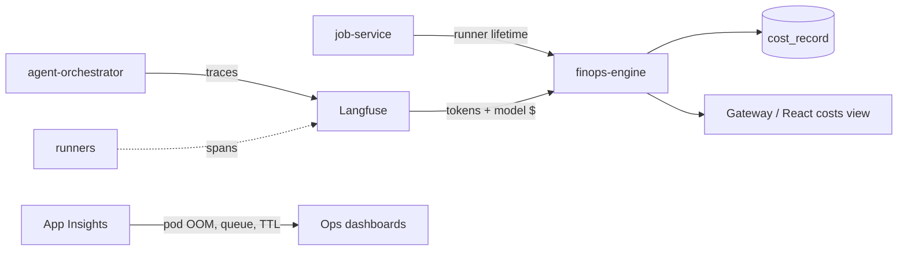

# ADR-001 — Vanilla Agentic Platform Architecture Design Record

| Field | Value |
|-------|-------|
| **Status** | Accepted (initial design) |
| **Date** | 2026-07-23 |
| **Supersedes** | — |
| **Related** | [`ARCHITECTURE.md`](../../ARCHITECTURE.md), [`02-microservices-map`](../02-microservices-map.md), [`gateway-api-contracts`](../../skills/gateway-api-contracts/reference.md) |
| **Stack binding** | [`framework/.stack.md`](../../framework/.stack.md) |

---

## 1. Purpose

This Architecture Design Record (ADR) locks the **initial technology stack** onto the Vanilla Agentic Framework topology already defined in `ARCHITECTURE.md` and the Microservice Catalogue.

It does **not** invent a new service map. It answers: *for each component in the catalogue, what do we build with?*

**Canonical sources of truth**

| Concern | Source |
|---------|--------|
| Platforms, layers, job lifecycle, skills, HITL, FinOps, Adaption | `ARCHITECTURE.md` |
| Deployable services + ownership | Microservice Catalogue (below + `02-microservices-map`) |
| Public HTTP/SSE contracts | `skills/gateway-api-contracts/reference.md` |
| Language / library choices | This ADR + `framework/.stack.md` |
| Fabric codegen skills | [`skills/README.md`](../../skills/README.md) — one skill per logical fabric for Cursor / GHCP / VS Code |

---

## 2. Decision summary

| Layer | Choice |
|-------|--------|
| **Frontend** | React + Redux Toolkit + OAuth 2.0 / OIDC (Microsoft Entra ID) |
| **API edge & microservices** | FastAPI (Python) behind a single **gateway** |
| **Agentic orchestration** | **LangGraph** + **Deep Agents** |
| **LLM** | **OpenAI** (chat + embeddings where needed) |
| **Observability & skill prompts** | **Langfuse** (traces + Prompt Management / skill registry) |
| **Datastore** | **PostgreSQL** + **pgvector** |
| **Platform / cloud** | **Microsoft Azure** |
| **Auth** | **OAuth 2.0 / OIDC** via Entra ID (gateway validates JWT; UI uses authorization code + PKCE) |
| **Async events** | Azure Service Bus |
| **Ephemeral runners (Phase 1)** | Docker (local / ACI-adjacent) |
| **Ephemeral runners (Phase 3+)** | Azure Kubernetes Service (AKS) via `SandboxBackendProtocol` |

### Clarification (important)

| Role | Technology |
|------|------------|
| **Agentic framework (control plane)** | LangGraph + Deep Agents |
| **Observability + procedural skill registry** | Langfuse |
| **Application / microservice runtime** | FastAPI on Azure |
| **Interactive UI** | React |

Langfuse is **not** the agent runtime. Agents run in LangGraph/Deep Agents; Langfuse stores production skill prompts and LLM/agent traces used by FinOps and debugging.

---

## 3. Component inventory (what you should see)

Everything below is part of the **initial design**. Clients never call execution services directly — only via **gateway**.



### Microservice catalogue (complete)

| # | Component | Platform | Responsibility | Stack (this ADR) |
|---|-----------|----------|----------------|------------------|
| 1 | **web** | Access | Guided wizard UI, HITL approve, FinOps/track views | React, Redux Toolkit, React Router, MSAL (OAuth/OIDC), SSE client |
| 2 | **mcp** | Access | MCP tools mapped 1:1 to Gateway | Python MCP SDK → gateway HTTP |
| 3 | **cli** | Access | Scriptable / CI client | Python (Typer/Click) → gateway HTTP |
| 4 | **gateway** | Access | AuthN/Z, RBAC, rate limits, REST + SSE routing | FastAPI, Entra JWT validation, Uvicorn, OpenAPI |
| 5 | **knowledge-service** | Skill & Knowledge | Engagements, skill metadata, semantic + episodic memory, change-request review | FastAPI, SQLAlchemy/asyncpg, Postgres + pgvector, Langfuse client |
| 6 | **job-service** | Execution | Job lifecycle, hybrid skip/re-run, HITL state, event publish | FastAPI, Postgres, Service Bus publisher |
| 7 | **agent-orchestrator** | Execution | LangGraph state machine, Deep Agents; consumes **mounted** skills | FastAPI workers, LangGraph, Deep Agents, OpenAI, Langfuse callback handler |
| 8 | **skill-loader** | Execution | Resolve production skills/facts/episodes; mount onto runners | FastAPI (or colocated package with orchestrator), Langfuse + knowledge-service clients |
| 9 | **sandbox-provisioner** | Execution | Create/destroy ephemeral runners; apply mounts | FastAPI, Docker SDK → AKS/ACI adapter (`SandboxBackendProtocol`) |
| 10 | **ephemeral runners** | Execution (data plane) | Phase workspaces: Research / Execution / Reporting / Custom | Container images; OpenAI; workspace on Azure Files |
| 11 | **finops-engine** | Evaluation | Cost per run from Langfuse + runner lifetime | FastAPI, Postgres `cost_record`, Langfuse ingest |
| 12 | **adaption-engine** | Engagement | Tracks + stakeholder email | FastAPI, Service Bus consumer, Microsoft Graph mail, Postgres |

### Shared infrastructure

| Component | Role | Azure / product binding |
|-----------|------|-------------------------|
| **PostgreSQL + pgvector** | Structured domain data + embeddings | Azure Database for PostgreSQL Flexible Server |
| **Langfuse** | Procedural prompts (`draft` / `staging` / `production`) + tracing | Self-hosted on AKS **or** Langfuse Cloud (TBD ops choice; API contract identical) |
| **Azure Service Bus** | Durable job/lifecycle event fan-out | Topics/subscriptions for Adaption + FinOps |
| **Runner workspace store** | Per-job skill artifacts | Azure Files / Blob + PVC |
| **OpenAI** | LLM + embeddings | Azure OpenAI **or** OpenAI API (record deployment names in `.stack.md`) |
| **Microsoft Entra ID** | Identity provider | App registrations for web + API |
| **Azure Container Apps / AKS** | Host FastAPI services + runners | Phase 1: containers; Phase 3: AKS runners |
| **Application Insights** | Infra metrics (queue depth, OOM, TTL) | Complements Langfuse (not a replacement) |

---

## 4. Logical platforms & layers

Unchanged from architecture; stack bindings added.

### Physical platforms

| Platform | Components | Technologies |
|----------|------------|--------------|
| **Access** | web, mcp, cli, gateway | React/Redux/MSAL · FastAPI gateway · Entra |
| **Skill & Knowledge** | knowledge-service, Langfuse, Postgres | FastAPI · Langfuse · Postgres/pgvector |
| **Execution** | job-service, agent-orchestrator, skill-loader, sandbox-provisioner, runners | FastAPI · LangGraph/Deep Agents · Docker/AKS · OpenAI |

### Logical layers

| Layer | Microservices | Key tech |
|-------|---------------|----------|
| Connectivity | gateway, web, mcp, cli, adaption (outbound mail) | FastAPI, React, SSE, Graph |
| Context | knowledge-service, Langfuse prompts, Postgres memory | pgvector, Langfuse Prompt Management |
| Orchestrator | job-service, agent-orchestrator | LangGraph checkpoints, Deep Agents |
| Execution | sandbox-provisioner, runners, skill-loader | Mount contract, Docker/AKS |
| Evaluation | Langfuse traces, finops-engine | cost_record, App Insights |

---

## 5. Frontend — React

### 5.1 Technologies

| Concern | Choice | Notes |
|---------|--------|-------|
| UI library | **React 18+** | Guided wizard is first-class |
| State | **Redux Toolkit** | Engagement, job, wizard step, HITL, cost/track slices |
| Routing | React Router | Engagement-centric routes |
| Auth | **MSAL.js** + OAuth 2.0 / OIDC (Entra) | Auth code + PKCE; acquire access token for gateway |
| API client | fetch / RTK Query | Bearer JWT on every call |
| Live progress | **EventSource (SSE)** | `GET …/jobs/{job_id}/events` |
| Styling | Project design system (TBD) | Keep wizard focused; no business logic in UI |

### 5.2 UI capabilities (map to gateway)

| Screen / flow | Gateway |
|---------------|---------|
| Open / list engagements | `POST/GET /engagements` |
| Guided Research wizard | `POST …/research` + SSE |
| Confirm findings | `GET …/findings` |
| Run Planning | `POST …/plan` |
| HITL approve / revise | `POST …/approve` |
| Execution / Reporting | `POST …/execute`, `…/report` |
| Artifacts + Final Deliverable | `GET …/artifacts`, `…/final-deliverable` |
| FinOps | `GET …/costs` |
| Engagement track | `GET …/track` |

### 5.3 Redux slice sketch

| Slice | Owns |
|-------|------|
| `auth` | MSAL account, token expiry, roles from claims |
| `engagements` | List + current engagement |
| `job` | Current job status, phase, errors |
| `wizard` | Research steps, draft findings, confidence |
| `artifacts` | Skill artifact metadata + payloads |
| `hitl` | Plan awaiting approval, comments |
| `finops` | Cost rollups |
| `track` | Adaption engagement track |

Clients stay **thin** — no orchestration logic in React.

---

## 6. Backend — FastAPI microservices

All services (unless noted) are **FastAPI** apps deployed on Azure, sharing:

- Python 3.12+
- Pydantic v2 models aligned to gateway contracts
- OpenAPI per service; gateway aggregates / proxies public surface
- Structured logging + correlation IDs (`engagement_id`, `job_id`)
- Entra JWT validation at **gateway** (services may trust mTLS/network + forwarded identity headers in-cluster)

### 6.1 Gateway (Access edge)

| Concern | Choice |
|---------|--------|
| Framework | FastAPI + Uvicorn |
| Auth | Validate Entra JWT (audience = API app); map roles → RBAC |
| Roles | `viewer`, `operator`, `skill-author`, `skill-reviewer`, `admin`, `finops-viewer` |
| Protocols | REST JSON + SSE pass-through |
| Cross-cutting | Rate limits, CORS for web origin, request ID |

**Public base path:** `/api/v1`

#### Endpoint catalogue (engagement-centric)

| Method | Path | Phase | Owner behind gateway |
|--------|------|------:|----------------------|
| `POST` | `/engagements` | 1 | knowledge-service |
| `GET` | `/engagements` | 1 | knowledge-service |
| `GET` | `/engagements/{id}` | 1 | knowledge-service |
| `POST` | `/engagements/{id}/research` | 1 | job-service → orchestrator / Research runner |
| `GET` | `/engagements/{id}/findings` | 1 | job-service / knowledge-service |
| `GET` | `/engagements/{id}/jobs/{job_id}` | 1 | job-service |
| `GET` | `/engagements/{id}/jobs/{job_id}/events` | 1 | job-service (SSE) |
| `GET` | `/engagements/{id}/jobs/{job_id}/artifacts` | 1 | job-service |
| `GET` | `/engagements/{id}/jobs/{job_id}/artifacts/{artifact_id}` | 1 | job-service |
| `POST` | `/engagements/{id}/plan` | 2 | job-service → orchestrator |
| `POST` | `/engagements/{id}/approve` | 2 | job-service (HITL) |
| `POST` | `/engagements/{id}/execute` | 3 | job-service → Execution runner |
| `POST` | `/engagements/{id}/report` | 3 | job-service → Reporting runner |
| `GET` | `/engagements/{id}/jobs/{job_id}/final-deliverable` | 3 | job-service |
| `GET` | `/engagements/{id}/costs` | 5 | finops-engine |
| `GET` | `/engagements/{id}/track` | 5 | adaption-engine |

There is **no** merge-request / PR endpoint. Full schemas: [`gateway-api-contracts/reference.md`](../../skills/gateway-api-contracts/reference.md).

### 6.2 knowledge-service

| Concern | Choice |
|---------|--------|
| API | FastAPI |
| DB | Azure Postgres + pgvector |
| ORM / driver | SQLAlchemy 2 async + asyncpg |
| Langfuse | Fetch `production` labeled prompts; store pointers in `skill_meta` |
| Owns | `engagement`, `guided_session`, `skill_meta`, `org_asset`, `episode`, `change_request` |

### 6.3 job-service

| Concern | Choice |
|---------|--------|
| API | FastAPI |
| DB | Azure Postgres (job schema) |
| Bus | Azure Service Bus publisher |
| Owns | `job`, `skill_artifact`, `plan_recommendation`, `final_deliverable_document` |
| HITL | Persist `awaiting_approval`; honor approve/revise |

### 6.4 agent-orchestrator + skill-loader

| Concern | Choice |
|---------|--------|
| Runtime | FastAPI process(es) + async workers |
| Graph | **LangGraph** durable state machine (checkpointed) |
| Agents | **Deep Agents** (orchestrator may fan out sub-agents within a phase) |
| LLM | **OpenAI** via official SDK / LangChain OpenAI bindings |
| Tracing | Langfuse callback / OTel → Langfuse (`job_id` root span) |
| Checkpoints | Postgres or LangGraph checkpoint store (dedicated) |
| Mount rule | Orchestrator **does not** inject skills; **skill-loader** mounts; agents only use mounted skills |

**skill-loader** talks to: knowledge-service / Langfuse → sandbox-provisioner → ephemeral runner mount.

### 6.5 sandbox-provisioner

| Concern | Choice |
|---------|--------|
| API | FastAPI |
| Phase 1 backend | Docker (`SandboxBackendProtocol`) |
| Phase 3 backend | AKS Jobs/Pods (same protocol) |
| Workspace | Azure Files share mounted into runner |
| Lifecycle | TTL + sweeper for orphaned runners |

### 6.6 finops-engine

| Concern | Choice |
|---------|--------|
| API | FastAPI |
| Ingest | Langfuse spans (tokens/model $) + job-service runner lifetime events |
| Owns | `cost_record` only |
| Exposure | `GET /engagements/{id}/costs` via gateway |

### 6.7 adaption-engine

| Concern | Choice |
|---------|--------|
| API | FastAPI |
| Ingest | Service Bus lifecycle events |
| Mail | Microsoft Graph (Azure-aligned) |
| Owns | `engagement_track`, `email_event` |
| Scheduler | Idle/SLA sweep (separate from event consumer) |

### 6.8 mcp + cli

| Client | Stack | Rule |
|--------|-------|------|
| **mcp** | Python MCP server | Tools mirror gateway routes 1:1 |
| **cli** | Python Typer | Same routes; CI-friendly |

---

## 7. LangGraph + Deep Agents

### 7.1 Responsibilities

| Capability | How |
|------------|-----|
| Durable phases | LangGraph nodes for Research → Planning → HITL → Execution → Reporting → Compose |
| Pause / resume | Interrupt before irreversible Execution (HITL); resume on `approve` |
| Hybrid skip / re-run | Conditional edges when prior artifacts remain valid |
| Sub-agents | Deep Agents fan-out inside a phase; consolidate results |
| Wizard collaboration | Research node streams steps to UI via job-service SSE |
| Isolation | One runner workspace per job; no cross-job leakage |

### 7.2 Technology detail

| Item | Choice |
|------|--------|
| Library | `langgraph` + Deep Agents package (Python) |
| Model | OpenAI (e.g. `gpt-4.1` / team-selected deployment) |
| Tooling | Tools available only after skill-loader mount |
| Persistence | LangGraph checkpointer (Postgres) |
| Observability | Langfuse tracing on graph + LLM calls |
| Human gate | Primary HITL after Plan & Recommendation artifact |

### 7.3 Phase → runner mapping

| Phase / skill | Runner | Artifact |
|---------------|--------|----------|
| Research | Research runner | Research Findings Artifact |
| Planning | Orchestrator / planning path | Plan & Recommendation Artifact |
| Execution | Execution runner | Execution Report Artifact |
| Reporting | Reporting runner | Summary Artifact |
| Compose | Control plane composition | **Final Deliverable Document** |

---

## 8. Langfuse (observability + skill registry)

| Concern | Choice |
|---------|--------|
| Tracing | Every agent/LLM span under `job_id` / `engagement_id` / `skill_key` |
| Prompt / skill registry | Procedural skill content with labels `draft` → `staging` → `production` |
| Consumers | skill-loader (resolve production), finops-engine (token/model cost), engineers (debug) |
| Governance | Skill-reviewer HITL publishes via change_request → Langfuse label move |
| Rollback | Re-point `production` label |

Langfuse complements **Application Insights** (infra). FinOps is the **cost truth** store (`cost_record`), not Langfuse alone.

---

## 9. Data & domain model

Anchored on **Engagement ID** (not a git repo). **No Merge Request** in the process.

| Entity | Owning service | Store |
|--------|----------------|-------|
| Engagement | knowledge-service | Postgres |
| Guided Session | knowledge-service | Postgres |
| Job / Skill Artifact / Plan / Final Deliverable | job-service | Postgres + object/workspace store |
| Episode / org facts | knowledge-service | Postgres + pgvector |
| Cost Record | finops-engine | Postgres |
| Engagement Track / Email Event | adaption-engine | Postgres |
| LangGraph checkpoints | agent-orchestrator | Checkpoint store |
| Procedural prompts | Langfuse | Langfuse |

### Memory types

| Memory | Store | Access |
|--------|-------|--------|
| Procedural | Langfuse `production` | skill-loader |
| Semantic | Postgres + embeddings | knowledge-service |
| Episodic | Postgres + embeddings | knowledge-service |

---

## 10. Azure platform mapping

| Concern | Azure service |
|---------|---------------|
| Compute (APIs) | Azure Container Apps **or** AKS |
| Compute (runners) | Docker locally → AKS Jobs |
| Identity | Microsoft Entra ID |
| Database | Azure Database for PostgreSQL Flexible Server (+ pgvector) |
| Messaging | Azure Service Bus |
| Secrets | Azure Key Vault |
| Files / artifacts | Azure Files / Blob Storage |
| LLM | Azure OpenAI Service **preferred** (or OpenAI API with Key Vault secrets) |
| Email | Microsoft Graph |
| Infra telemetry | Application Insights + Log Analytics |
| CI/CD | Azure DevOps or GitHub Actions → ACR |

---

## 11. Security & auth

| Layer | Mechanism |
|-------|-----------|
| User login (web) | OAuth 2.0 / OIDC authorization code + PKCE (MSAL) |
| API calls | Bearer access token to gateway |
| Gateway | Validate JWT, enforce RBAC roles |
| Service-to-service | Private network / mTLS; no public runner ports |
| Secrets | Key Vault; never in images or skill mounts |
| Runners | Least privilege; credentials injected for the phase only |
| Skills | Centralized mounts only — never baked into images |

---

## 12. Observability & FinOps



---

## 13. Job lifecycle (unchanged process)

Default: **Research → Planning → HITL → Execution → Reporting → Compose Final Deliverable Document**.

- Skills may be **skipped** or **re-run** (hybrid).
- Primary human gate: **after Planning**.
- Outputs are **skill artifacts** + Final Deliverable Document — **no MR/PR**.

Domain events (Service Bus):  
`job.created` · `job.phase_started` · `job.phase_succeeded` · `job.phase_failed` · `job.awaiting_approval` · `job.approved` · `job.revise_requested` · `artifact.created` · `final_deliverable.created` · `wizard.abandoned` · `cost.recorded` · `engagement.track_updated`

---

## 14. Monorepo layout (target)

```
framework/
├── apps/
│   ├── web/                 # React + Redux + MSAL
│   ├── cli/                 # Python Typer
│   └── mcp/                 # Python MCP
├── services/
│   ├── gateway/             # FastAPI
│   ├── knowledge/           # FastAPI
│   ├── job/                 # FastAPI
│   ├── orchestrator/        # FastAPI + LangGraph + Deep Agents + skill-loader
│   ├── sandbox/             # FastAPI provisioner
│   ├── finops/              # FastAPI
│   └── adaption/            # FastAPI
├── runners/                 # Container images
├── infra/                   # Bicep/Terraform, Service Bus, Postgres, AKS
├── docs/                    # Architecture + this ADR
├── skills/                  # Runtime SKILL.md seed content
└── .stack.md                # Binding for implementation agents
```

---

## 15. Build order (synced with ARCHITECTURE.md)

| Phase | Scope | Stack focus |
|------:|-------|-------------|
| **0** | This ADR + `.stack.md` + monorepo skeleton | Docs / binding |
| **1** | gateway + job-service + Engagement + Research wizard + Docker runner + Skill 1 | FastAPI, React, OpenAI, SSE |
| **2** | Planning + HITL + skill-loader + Langfuse registry | LangGraph interrupt, Langfuse prompts |
| **3** | Execution + Reporting + AKS runners + Final Deliverable | Mount contract, AKS |
| **4** | knowledge memory (episodes, reflection, skill-review) + MCP/CLI parity | pgvector, MCP |
| **5** | finops-engine + adaption-engine + dashboards | Service Bus, Graph, cost_record |

---

## 16. Design principles (retained)

Modular microservices · Scalable runners-on-demand · Portable `SandboxBackendProtocol` · Open REST + MCP + CLI · HITL after plan · Agent/sub-agent separation · skill-loader as sole mount authority · FinOps + Adaption as separate services · Engagement-centric, artifact-first, **no MR**.

---

## 17. Consequences

**Positive**

- Single coherent stack (Python FastAPI + React) matches LangGraph/Deep Agents ecosystem.
- Azure + Entra aligns enterprise identity and ops.
- Langfuse gives both skill governance and agent traces without inventing a registry.
- Clear separation: UI ≠ gateway ≠ orchestrator ≠ runners.

**Trade-offs / follow-ups**

- Langfuse hosting (Cloud vs self-hosted on AKS) still TBD ops.
- Azure OpenAI vs OpenAI API: pick one deployment path and record model names in `.stack.md`.
- Orchestrator and skill-loader may colocate in one deployable early; keep **API boundaries** even if colocated.
- Redux chosen for predictable wizard/HITL state; avoid putting server orchestration into the store.

---

## 18. Open items (from architecture; still TBD)

- Domain skill catalog for first concrete use case
- Live enrichment mechanisms per data source
- Plan scoring dimensions and weights
- FinOps v1: model $ only vs include runner compute $
- Quiet hours / unsubscribe policy for Adaption email

---

## 19. Decision log

| Decision | Choice | Rationale |
|----------|--------|-----------|
| Frontend | React + Redux + OAuth (Entra/MSAL) | Interactive wizard + enterprise SSO |
| Backend | FastAPI microservices | Fits LangGraph Python; fast OpenAPI |
| Agentic runtime | LangGraph + Deep Agents | Durable graphs, HITL, sub-agents |
| Observability / skill prompts | Langfuse | Traces + labeled procedural skills |
| LLM | OpenAI (Azure OpenAI preferred) | Standard enterprise LLM path |
| Data | Postgres + pgvector | Structured + semantic/episodic memory |
| Cloud | Azure | Entra, Service Bus, AKS, Graph mail |
| Process outputs | Artifacts + Final Deliverable | No MR/PR by design |
